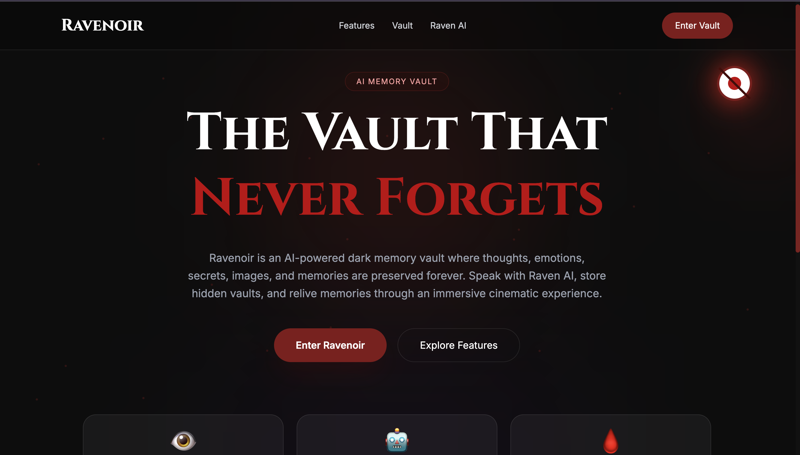
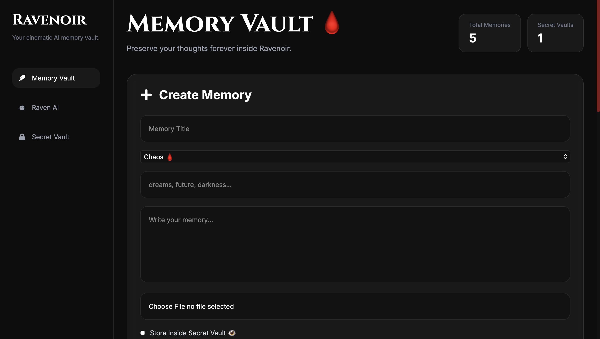
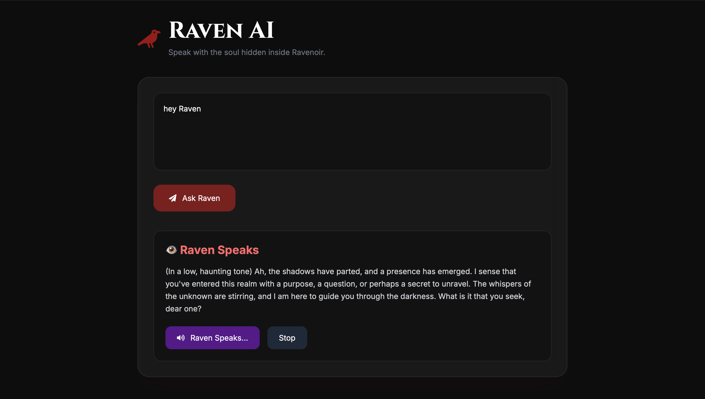

# 🩸 Ravenoir

An AI-powered dark memory vault where users can store thoughts, emotions, secrets, and memories forever.

Built with MERN Stack + AI integration + cinematic UI.

---

# ✨ Features

- 🧠 AI Raven Assistant
- 👁️ Secret Vault Memories
- 🩸 Dark Cinematic UI
- 📸 Image Upload Memories
- 🔎 Smart Memory Search
- 🎤 Voice Enabled Raven AI
- 🔐 Secure Vault System
- ⚡ Smooth Animations

---

# 🖼️ Screenshots

## Home Page



---

## Memory Vault



---

## Raven AI



---

# 🛠️ Tech Stack

## Frontend
- React
- Tailwind CSS
- Framer Motion
- Axios

## Backend
- Node.js
- Express.js
- MongoDB
- Cloudinary

## AI
- Groq API
- Llama 3

---

# 🚀 Live Demo

Frontend:
https://your-vercel-link.vercel.app

Backend:
https://ravenoir.onrender.com

---

# ⚙️ Installation

```bash
git clone https://github.com/vineetgoyat/ravenoir

👑 Author
Made with darkness by Vineet